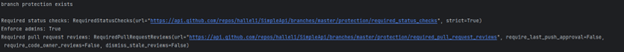

# README - Cloud Security Developer

Welcome to my exercise :)

In this file You will understand about:
- configurations with a security impact with the compliance categories from NIST.
- how to set up and execute the script
- how running it will impact working with GitHub

Enjoy!

## configurations with a security impact
1. **Enforce Branch Policies Rules** - Configuration Management

Helps ensure that changes are vetted and approved, reducing the risk of introducing vulnerabilities or malicious code into the codebase. This prevents unauthorized changes and maintains the integrity of the project.
2. **Two-Factor Authentication (2FA)** -  Identification and Authentication

Adds an extra layer of security by requiring a second form of verification beyond just a password. This significantly reduces the risk of unauthorized access.
3. **Scanning For Secrets** - System and Information Integrity

Helps prevent potential security breaches by ensuring that sensitive information is not exposed in version control, where it can be accessed by unauthorized users.
4. **Vulnerability Alerts** - Risk Assessment

Vulnerability alerts notify when dependencies in their projects are found to be vulnerable. This allows teams to update or patch dependencies promptly, reducing the window of opportunity for attackers to exploit known vulnerabilities in the project's dependencies.
5. **Access Tokens and SSH Key Management** - Access Control

Ensures that access to repositories is securely controlled.


## Enforcement of branch policy rules in details:

### The best practice:
As a best practice, it's recommended to set up branch policies that include:
- **Require code reviews** before merging changes, ensuring at least one or more team members review and approve the changes.
- **Enforce status checks** like automated tests or build processes, ensuring the code works as expected before it's merged.
- **Restrict who can merge changes** to certain branches, typically protecting your main or master branch from unauthorized modifications.
- **Require branches to be up to date** before merging, reducing conflicts and ensuring compatibility with the latest changes.

### The meaning of this configuration:

Enforcing branch policies is setting rules for how and when changes can be made to the master.
These rules help ensure that changes are reviewed, tested, and approved before they're officially made part of the project. It's a way to maintain quality and security by preventing unvetted or harmful changes.

### What happens when the configuration is not configured according to the best practice, and the risks involved:
- Unreviewed changes could introduce errors or vulnerabilities, risking the project's stability and security.
- Sensitive branches like master branch could be accidentally or maliciously modified, leading to potential disruption or compromise.

### Steps to fix the configuration manually and, if possible, work around these risks in another way.

To fix this configuration manually on platforms like GitHub:
1. Go to your repository settings.
2. Find the section for branch protection rules or similar.
3. Create or edit rules for your main branches, setting requirements for reviews, status checks, and who can merge changes.


### How will changing the configuration impact working with GitHub?

Implementing these rules will make the development process more structured. It might slow down the pace at which changes are made, as they need to be reviewed and meet all requirements, but this is a trade-off for increased quality and security.

### Related MITRE Techniques
If branch policies are lax, an attacker could exploit vulnerabilities introduced in unreviewed code to gain unauthorized access or control. 
The relevant technique from the MITRE ATT&CK framework related to improper branch policy enforcement is "Exploit Public-Facing Application". 
By enforcing branch policies, you minimize the risk of such vulnerabilities being introduced and exploited.

# The Python Code
This script using an old public repo name SimpleApi.

### how to run this script:

```bash
pip install pyGithub
```

#### create Github token
use this [guide
](https://docs.github.com/en/authentication/keeping-your-account-and-data-secure/managing-your-personal-access-tokens#creating-a-fine-grained-personal-access-token)
 to create a token for GitHub

Then add this token to environment variables of your project:
 
 
Then press the Add button, add "GITHUB_TOKEN" in the name, and the token value in the value column.
then run the code.

## explain code
In the code there are three solutions to configurations with a security impact:
1. Enforce Branch Policies Rules
2. Scanning For Secrets
3. Vulnerability Alerts

## Enforce Branch Policies Rules
In this section the code checks branch policies status.
If there is no branch policies he will create one.
The script build a rule that: 
 - ensures that the branch protection rules apply to administrators as well
 - requirement for branches to be up-to-date before merging
 - contexts=[]: An empty list [] means no specific status checks are required for merging. In a more stringent setup, this might include tests, code quality checks, etc.
 - should be at least one approval from other users (reviewers) before changes can be merged into the protected branch. 

### run the script
In a case that there is a branch protection rule the output will be:

otherwise, the script will create one, then the output will be:


we can see in GitHub that is created a branch protection rule:


### how running it will impact working with GitHub
Creating branch protection will enforce will force a check of the new code before insertion it into the branch it was run on (Mostly branches with sensitivity like the master).
requiring all changes to be reviewed by at least one other person, ensuring that even administrators adhere to these rules, and necessitating that the branch is up-to-date before merging. This will enhance the security and quality of the code but may slow down the merging process due to the additional requirements.
and necessitating that the branch is up-to-date before merging. This will enhance the security and quality of the code but may slow down the merging process due to the additional requirements.

If a user will try to insert code directly into this branch they will get the following error:


## Scanning For Secrets
This configuration will search about secrets in the repository, It recursively goes through all the code files.
This code demonstrating search about passwords in the repository, and alerts about it.

# Attention:
Regular expressions might not catch all secrets, especially those that don't follow a predictable pattern. Consider integrating with dedicated secret scanning tools for a more thorough analysis!

### run the script
The code demonstrates a user entering hardcode password in the repo.
after run the script - He will receive a notification about the password and in which file it appears.
example to output:


### how running it will impact working with GitHub
Those responsible for the repo will receive a notification about the secrets.


## Vulnerability Alerts
This configuration will search about security vulnerabilities in a repository's dependencies.
I demonstrated this on old Rapo that uses Flask library.
the output of this:

You can see this alert also in GitHub:


### how running it will impact working with GitHub
Running this enables automated, detailed insights into repository vulnerabilities, enhancing security response efficiency. It facilitates proactive vulnerability management by providing precise data on affected packages and patch information directly within your workflow, significantly improving the security posture of your GitHub repositories.

## That's it for now, hope you enjoy!